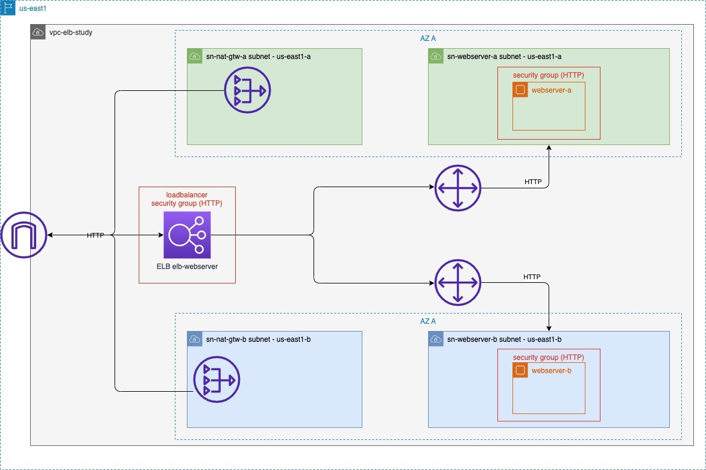

# AWS - ELB

Os códigos do Terraform criam a estrutura necessária para montar o ambiente especificado no diagrama.

## Arquitetura



## Arquivos

Arquivos:

- `main.tf`: configura o provedor cloud;
- `variables.tf`: declaram as variáveis utilizadas no Terraform (região AWS e blocos CIDR da VPC e suas subnets);
- `network.tf`: declara toda a rede necessárias:
  - VPC;
  - subnet A na zona `us-east-1a` e a subnet B na zona `us-east-1b`;
  - internet gateway para a VPC e uma NAT gateway para cada subnet;
  - uma route table para cada subnet vinculando seu NAT gateway.
- `security-group.tf`: declara o security group permitindo acesso na porta 80;
- `ec2.tf`: declara as duas instâncias de EC2, um na zona `us-east-1a` e outro na `us-east-1b`;
- `elb.tf`: declara o ELB, o target group para as duas instâncias do EC2 e declara o listener no ELB.
- `outputs.tf`: declara a saída para mostrar o DNS gerado para o ELB.

Exemplo de saída:

```bash
elb-study-dns = "DNS: elb-webserver-XXXXXXXXXX.us-east-1.elb.amazonaws.com"
```

