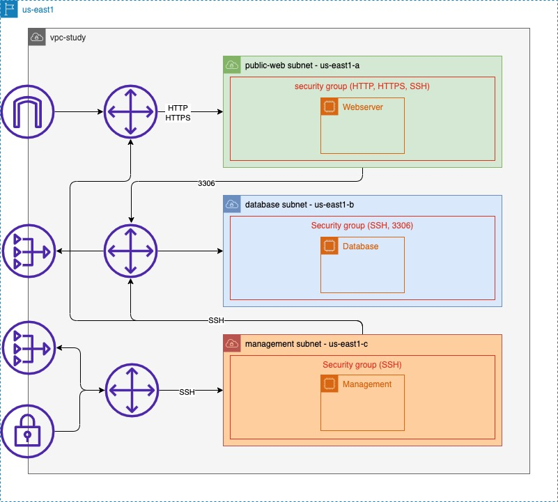

# AWS - VPC

Os códigos do Terraform criam a estrutura necessária para montar o ambiente especificado no diagrama.

## Arquitetura

## Arquivos

Arquivos:

- `main.tf`: configura o provedor cloud;
- `variables.tf`: declaram as variáveis utilizadas no Terraform (região AWS e blocos CIDR da VPC e suas subnets);
- `vpc.tf`: declara a VPC (`vpc-study`);
- `subnets.tf`: declara as três subnets da VPC (`public-web`, `database` e `management`);
- `gateways.tf`: declara os gateways utilizados em cada subnet:
  - `igw-study`: Internet Gateway utilizado pela subnet `public-web` para receber acesso da internet;
  - `eip-database`: Elastic IP para ser utilizado no NAT Gateway da subnet `database`;
  - `eip-management`: Elastic IP para ser utilizado no NAT Gateway da subnet `management`;
  - `nat-database`: NAT Gateway utilizado na subnet `database`;
  - `nat-management`: NAT Gateway utilizado na subnet `management`.
- `route-tables.tf`: declara as tabelas de roteamento das subnets e associa cada uma delas a sua subnet:
  - `rt-public-web`: Route Table da subnet `public-web` com a rota para acessar internet;
  - `rt-database`: Route Table da subnet `database` com a rota para acessar NAT Gateway `nat-database`;
  - `rt-management`: Route Table da subnet `management` com a rota para acessar a NAT Gateway `nat-management`.

